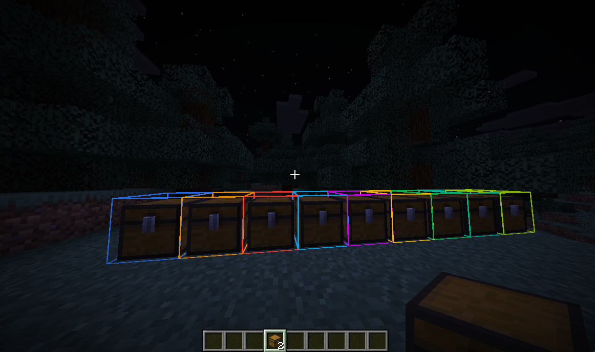
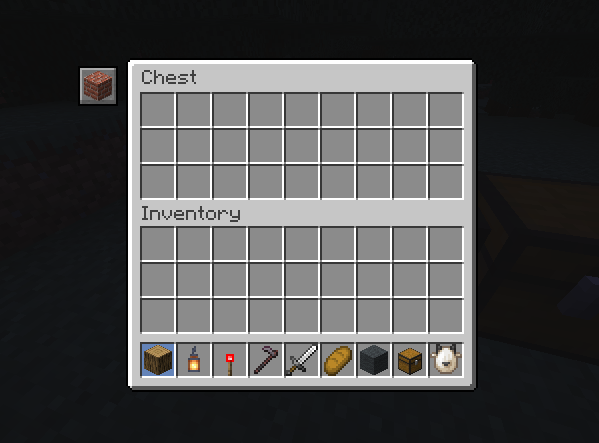
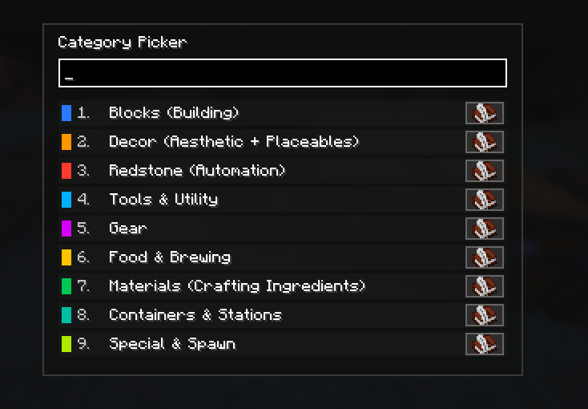
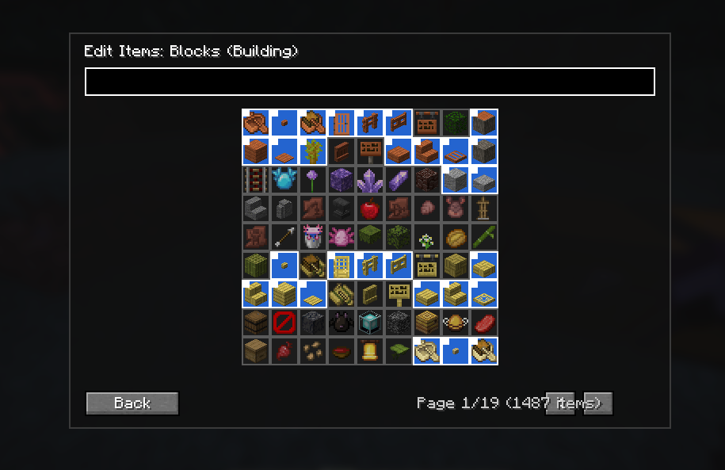
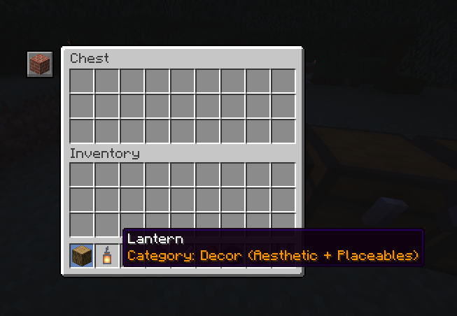
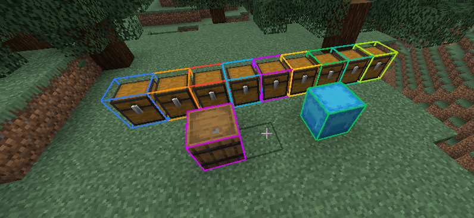
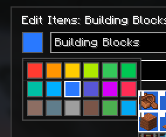

# Latch & Label

Client-side Fabric mod for chest tagging and item finding.

## Features
- Tag placed inventory blocks (any block entity inventory, plus ender chests) with categories.
- Quick apply (`Shift + Open Category Picker`) and quick clear (`Ctrl + Open Category Picker`) for looked-at containers.
- Category picker UI with search, numeric hotkeys, and recent category row.
- Container screen tag button for chest-like screens.
- `/find` command with optional block-variant expansion.
- Temporary world highlights for find results.
- Optional clickable find overlay list.
- Shift tooltip category display for mapped items.

## Keybinds
- `Open Category Picker` (default `B`): Open category picker for targeted container.
- `Shift + Open Category Picker`: Apply last-used category to targeted container.
- `Ctrl + Open Category Picker`: Clear tag from targeted container.
- `Run Find Shortcut` (default unbound): Runs find using the main-hand item and default find radius.

Notes:
- The find shortcut can be disabled in Mod Menu settings (`Allow find shortcut keybind`).
- Inspect mode trigger is configurable in Mod Menu settings:
  - `Alt only`
  - `Shift only` (sneak key)
  - `Alt or Shift`

## Tagging Rules
- Tagging applies to placed container blocks only.
- Current supported targets include any placed inventory block entity, plus ender chests.
- Data is client-local and stored in the client config directory.

## Inspect Mode Visuals
- Inspect mode activation depends on `Inspection mode trigger` setting (Alt, Shift/sneak, or both).
- Find highlights render as centered half-block boxes.
- Exact matches and variant matches use different visual styles.

## `/find` Usage
- `/find`: uses main hand item.
- `/find <itemid>`
- `/find <itemid> <radius>`
- `/f ...`: same as `/find ...` when `Allow /f command alias` is enabled in settings.

Notes:
- Scans are client-side.
- Results are limited to nearby loaded storage blocks.
- Inventory matching relies on client-visible inventory data.

## Config Files
All config files are under:
- `config/latchlabel/`

Primary files:
- `client_config.json`
- `categories.json`
- `tags.json`
- `item_categories_overrides.json`

Reload config in-game with:
- `/latchlabel reload`

Validate localization key coverage:
- `./scripts/check_i18n.sh`

## Development Notes
- This mod is client-only and uses a `client` entrypoint in `fabric.mod.json`.

## Screenshots

1. Inspect-mode outlines across tagged containers:

2. Container screen tag badge shown in a chest UI (icon at top-left of the container screen):

3. Category picker list with search and categories:

4. Item-to-category mapping editor for a category (paged item grid):

5. Container screen badge after assigning a different category:

6. Shift tooltip category display on an item:

7. Category color picker used to set outline/badge color:

8. Inspect-mode highlights across mixed storage types (chests, barrel, shulker):

