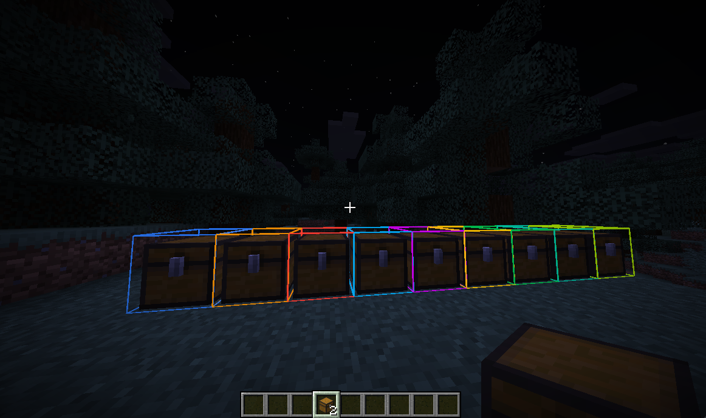
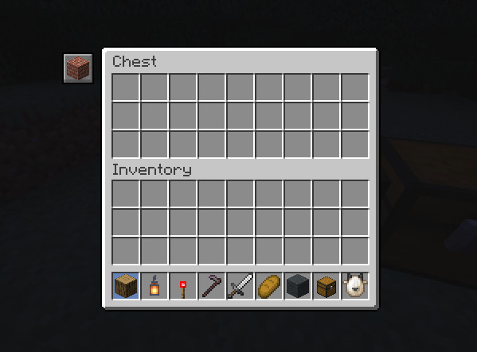
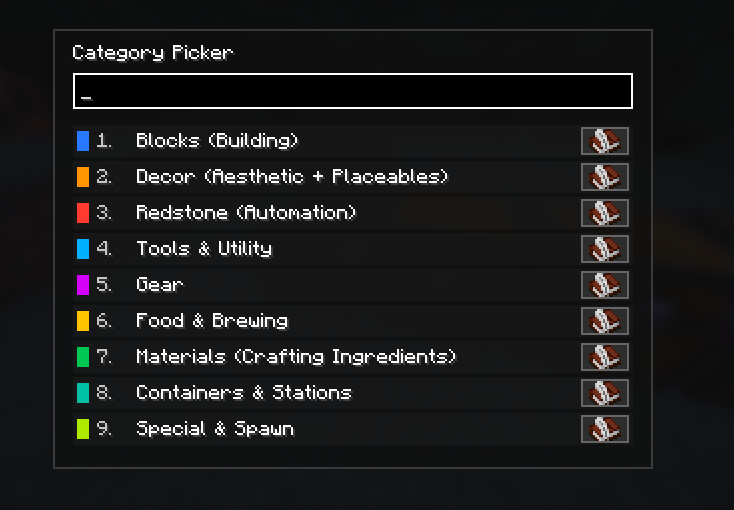
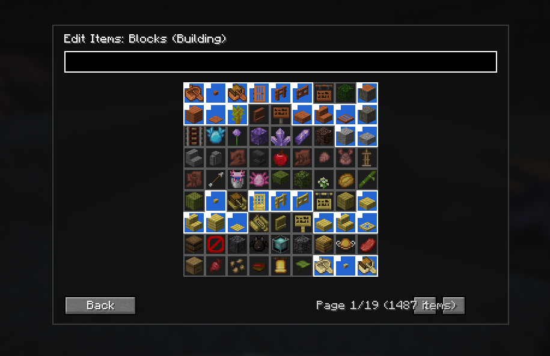
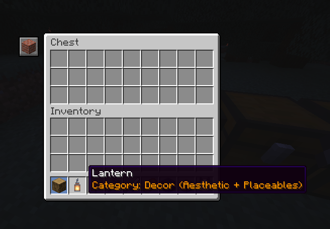
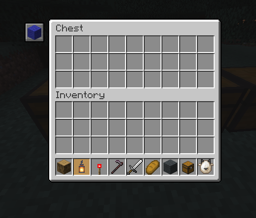
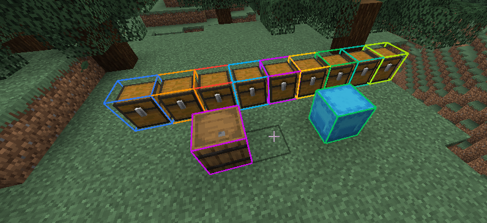
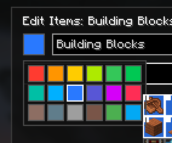

# Latch & Label

Client-side Fabric mod for chest tagging and item finding.

## Features
- Tag placed inventory blocks (any block entity inventory, plus ender chests) with custom categories.
- Create and manage categories with custom name, color (RGB picker), icon item, visibility, and sort order.
- Map items to categories with a visual editor; shift-hold tooltip shows an item's mapped category.
- Quick apply (`Shift + Open Category Picker`) and quick clear (`Ctrl + Open Category Picker`) for looked-at containers.
- Category picker UI with search, numeric hotkeys, and recent category row.
- Container screen tag button for chest-like screens.
- `/find` command with item search, category search (`#category`), and optional block-variant expansion.
- Temporary world highlights for find results with match-type distinction (exact, variant, possible).
- Optional clickable find overlay list.
- Inspect mode with color-coded outlines for all nearby tagged containers.
- Focused tag billboard: shows category name above crosshair when looking at a tagged container in inspect mode.
- Alt-click auto-move: Alt + click a tagged container to move matching items from your inventory into it.
- Book export/import for backing up or migrating tags and categories between worlds/servers.
- Per-world and per-server data scoping with automatic scope detection.

## Keybinds

| Keybind | Default | Function |
|---------|---------|----------|
| `Open Category Picker` | `B` | Open category picker for targeted container |
| `Shift + Open Category Picker` | | Apply last-used category to targeted container |
| `Ctrl + Open Category Picker` | | Clear tag from targeted container |
| `Run Find Shortcut` | Unbound | Run find using the main-hand item and default find radius |
| `Move to Storage` | Unbound | Move matching items from inventory to looked-at storage |

Notes:
- The find shortcut can be disabled in Mod Menu settings (`Allow find shortcut keybind`).
- Inspect mode trigger is configurable in Mod Menu settings:
  - `Alt only`
  - `Shift only` (sneak key)
  - `Alt or Shift` (default)

## Commands

### `/find`

Searches nearby loaded storage blocks for items or categories. Scans are client-side.

| Usage | Description |
|-------|-------------|
| `/find` | Uses item in main hand |
| `/find <itemid>` | Find specific item (e.g. `stone`, `minecraft:diamond_ore`) |
| `/find <itemid> <radius>` | Find item within custom radius (1-256) |
| `/find #<category>` | Find containers tagged with a category (e.g. `#stones`) |
| `/find #<category> <radius>` | Category search with custom radius |
| `/f ...` | Alias for `/find` (when `Allow /f command alias` is enabled) |

**Match types:**
- **EXACT** — item exactly matches the search target.
- **VARIANT** — a block variant of the target was found (stairs, slabs, walls, fences, fence gates, buttons, pressure plates). Can be toggled via `Variant matching` setting.
- **POSSIBLE** — container is tagged with a category that maps to the searched item.

Results are sorted by match type (EXACT > VARIANT > POSSIBLE), then by distance.

### `/latchlabel`

| Usage | Description |
|-------|-------------|
| `/latchlabel reload` | Reload all config and data files |
| `/latchlabel config export [path]` | Export config profile to file |
| `/latchlabel config import <path>` | Import config profile from file |
| `/latchlabel book export` | Export tags/categories to a held writable book |
| `/latchlabel book import` | Import tags/categories from a held written book |

## Tagging Rules
- Tagging applies to placed container blocks only.
- Supported targets: any placed inventory block entity (chests, double chests, barrels, shulker boxes), plus ender chests.
- Double chests are normalized to a single key; tags persist across chest reconfiguration.
- Data is client-local and stored in the client config directory.

## Inspect Mode
- Activation depends on `Inspection mode trigger` setting (Alt, Shift/sneak, or both).
- Color-coded outlines matching each container's category color.
- Pulsing effect on containers matching the held item's category.
- Distance-based level-of-detail rendering (max 72 containers per frame).
- Focused tag billboard shows the category name above your crosshair when looking at a tagged container.

## Alt-Click Auto-Move
- Hold Alt and click a tagged storage block to automatically move matching items from your inventory into it.
- Configurable source via `Move source mode` setting: `inventory` (default) or `inventory + hotbar`.

## Book Export/Import
- Export all tags, categories, and item mappings to a writable book in your hand.
- Import from a written book to restore data.
- Useful for backup and migration between servers or worlds.
- Compact JSON serialization (max 100 pages, 1024 chars per page).

## Config (Mod Menu)

| Setting | Default | Description |
|---------|---------|-------------|
| Inspect range | 8 | Block radius for inspect mode visibility |
| Inspection mode trigger | Alt or Shift | Inspect activation mode |
| Default find radius | 24 | Default radius for find commands (1-256) |
| Highlight duration (seconds) | 10 | How long find highlights persist |
| Variant matching | Enabled | Match block variants (stairs, slabs, etc.) |
| Show find overlay list | Disabled | Clickable find results list on HUD |
| Allow /f command alias | Enabled | Enable `/f` shorthand for `/find` |
| Allow find shortcut keybind | Enabled | Enable find shortcut keybind |
| Auto-refresh contents | Disabled | Auto-refresh observed container contents |
| Move source mode | Inventory | Source for alt-click auto-move (`inventory` or `inventory + hotbar`) |

## Config Files
All config files are under:
- `config/latchlabel/`

Primary files:
- `client_config.json`
- `scopes/<server-or-world>/tags.json`
- `scopes/<server-or-world>/categories_and_overrides.json`

Each scope folder corresponds to one multiplayer server or one singleplayer world.
- `tags.json` stores `dimension|x,y,z -> categoryId` mappings for that scope.
- `categories_and_overrides.json` stores category definitions and item-category overrides for that scope.

Reload config in-game with:
- `/latchlabel reload`

Validate localization key coverage:
- `./scripts/check_i18n.sh`

## Development Notes
- This mod is client-only and uses a `client` entrypoint in `fabric.mod.json`.

## Screenshots

1. Inspect-mode outlines across tagged containers:

2. Container screen tag badge shown in a chest UI (icon at top-left of the container screen):

3. Category picker list with search and categories:

4. Item-to-category mapping editor for a category (paged item grid):

5. Container screen badge after assigning a different category:

6. Shift tooltip category display on an item:

7. Category color picker used to set outline/badge color:

8. Inspect-mode highlights across mixed storage types (chests, barrel, shulker):

